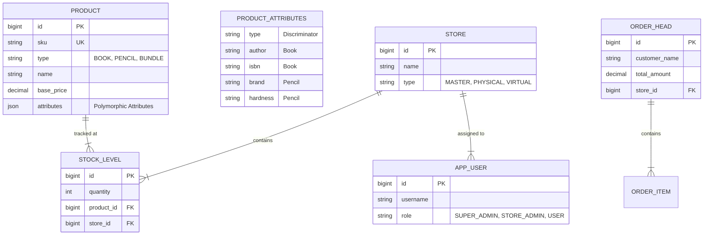

# System Architecture & Detailed Requirements

## 1. Executive Summary
The system is a distributed Inventory and Point-of-Sale (POS) solution designed for flexible, "adhoc" retailing. It enables the creation of **Virtual Stores**—temporary or mobile inventory allocations managed by specific employees—to sell products (books, stationery, etc.) in customizable bundles.

## 2. Functional Requirements Elaboration

### 2.1. Core Inventory Management (Headquarters/Admin)
*   **Product Definition**: Support for polymorphic products (`Book`, `Pencil`, `Apparel`) with type-specific attributes stored as JSON.
*   **Bundle Definition**:
    *   Create "Bundles" (e.g., "Grade 5 Set") composed of multiple products.
    *   **Exclusions/Modifications**: "Soft Bundles" where items can be removed or swapped at the point of sale.
*   **Stock Ingestion**:
    *   **Web**: Bulk upload or manual entry.
    *   **Mobile**: Scan ISBN/Barcode to ingest books via Google Books API or add manual products.
    *   **Master Inventory**: All stock initially enters the global warehouse (Master Store).

### 2.2. Virtual Store / Adhoc Store Management
*   **Concept**: A Virtual Store is a logical container of inventory assigned to an Employee (User).
*   **Allocation (Check-out)**:
    *   Admin transfers stock from Master Inventory -> Virtual Store.
    *   Real-time validations of available stock.
*   **Reconciliation (Check-in)**:
    *   At end of day/event, remaining stock is counted.
    *   System calculates `Expected Stock` vs `Actual Return`.
    *   Generates Discrepancy Reports.
    *   Restocks confirmed returns to Master Inventory.

### 2.3. Web Portal (Admin Dashboard & POS)
*   **Tech Stack**: **React 19**, **Vite**, **Axios**.
*   **Features**:
    *   **Inventory Manager**: Grid view with inline editing, creating products/bundles.
    *   **Store Manager**: Allocate/Return stock, Reconcile stores.
    *   **Point of Sale (POS)**: Responsive grid layout for selling items/bundles. Supports "Current Sale" cart management.
    *   **User Management**: Create/Manage users and role assignments.

### 2.4. Mobile Application (POS & Field Ops)
*   **Tech Stack**: **Native Android (Kotlin)** + **Jetpack Compose**.
*   **Sales Process**:
    *   Login via JWT.
    *   Select assigned Store (or Master if Admin).
    *   View Inventory & Bundles.
    *   Scan/Add items to Cart.
    *   Create Orders (Cash/Manual types).
*   **Field Operations**:
    *   **Add Inventory**: "Scan ISBN" (Auto-fetch details) or "Add Manually" (Stationery support).

## 3. System Components

### 3.1. High-Level Architecture
```mermaid
graph TD
    Mobile[Mobile App (Android/Kotlin)] -->|REST/JWT| Gateway
    Web[Web App (React/Vite)] -->|REST/JWT| Gateway
    
    subgraph "Backend Server (Spring Boot)"
        Gateway[API Endpoint (/api/v1)]
        Gateway --> Auth[Auth Service (JWT)]
        Gateway --> Inventory[Inventory Service]
        Gateway --> Store[Store Service]
        Gateway --> Order[Order Service]
        
        Inventory --> DB[(H2 File DB)]
        Store --> DB
        Order --> DB
    end
```

### 3.2. Component Breakdown

#### A. Mobile Application
*   **Network**: Retrofit + OkHttp.
*   **UI**: Jetpack Compose (Material3).
*   **Capabilities**:
    *   `InventoryScreen`: Searchable list, Add Product Dialog (Selection/Manual/ISBN).
    *   `NetworkModule`: Centralized Retrofit configuration.

#### B. Frontend Web Application
*   **Framework**: React 19 + React Router v7.
*   **Build Tool**: Vite.
*   **Styling**: CSS Modules + Responsive Design (Off-canvas sidebar, Grid layouts).
*   **State**: Local Component State + Effects.

#### C. Backend Server
*   **Framework**: Spring Boot 3.x.
*   **Security**: Spring Security + Stateless JWT Filter.
*   **Data Access**: JPA / Hibernate.
*   **Features**:
    *   `InventoryService`: Handles `ingestBook` (Google Books) and `createProduct`.
    *   `StoreService`: Critical allocation/return logic.

#### D. Database
*   **Technology**: **H2 Database** (File-mode: `./data/storefront`).
*   **Mode**: PostgreSQL Compatibility.
*   **Migration**: Flyway (implied by properties).

## 4. Data Model

### 4.1. Entity Relationship


## 5. API Surface (v1)

### Authentication
*   `POST /api/v1/auth/login` - Returns JWT.
*   `POST /api/v1/auth/register` - New user.
*   `GET /api/v1/auth/users` - List users.

### Inventory
*   `GET /api/v1/inventory/products` - List all definitions.
*   `POST /api/v1/inventory/products` - Create Product (Manual).
*   `POST /api/v1/inventory/ingest/isbn` - Ingest via Google Books.
*   `GET /api/v1/inventory/view?storeId={id}` - Get Stock Levels.
*   `POST /api/v1/inventory/stock` - Add global stock.

### Stores
*   `GET /api/v1/stores` - List stores.
*   `POST /api/v1/stores/{id}/allocate` - Move Master -> Store.
*   `POST /api/v1/stores/{id}/return` - Move Store -> Master.
*   `POST /api/v1/stores/{id}/reconcile` - Audit and close Store.

### Orders
*   `POST /api/v1/orders` - Process Sale (deducts stock).
