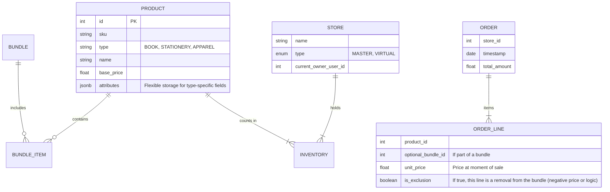

# System Architecture & Detailed Requirements

## 1. Executive Summary
The system is a distributed Inventory and Point-of-Sale (POS) solution designed for flexible, "adhoc" retailing. It enables the creation of **Virtual Stores**—temporary or mobile inventory allocations managed by specific employees—to sell products (specifically books) in customizable bundles.

## 2. Functional Requirements Elaboration

### 2.1. Core Inventory Management (Headquarters/Admin)
*   **Product Definition**: Support for simple products (Books) with metadata (ISBN, Title, Author, Price).
*   **Bundle Definition**:
    *   ability to create "Bundles" (e.g., "Grade 5 Set").
    *   **Exclusions/Modifications**: The structure must support "Soft Bundles" where items can be removed or swapped (e.g., "Student has Math Book, remove from bundle").
*   **Stock Ingestion**: Receiving inventory into the global warehouse (Master Inventory).
*   **Mobile Inventory Admin**: Admin users can use the mobile app to add/update Master Inventory (e.g., scanning incoming shipments).

### 2.2. Virtual Store / Adhoc Store Management
*   **Concept**: A Virtual Store is a logical container of inventory assigned to an Employee (User).
*   **Allocation (Check-out)**:
    *   Admin transfers stock from Master Inventory -> Virtual Store.
    *   Validation of available stock.
*   **Reconciliation (Check-in)**:
    *   At end of day/event, remaining stock is counted.
    *   System calculates: `Expected Stock = Allocated - Sold`.
    *   Discrepancy Reporting (Loss/Damaged).
    *   Return stock from Virtual Store -> Master Inventory.

### 2.3. Mobile App (Point of Sale & Admin)
*   **User Identity & Roles**: 
    *   **Admin**: Full access, including adding/updating Master Inventory.
    *   **Employee**: Restricted to specific Virtual Store sales and viewing.
*   **Offline Capability**: (Recommended) The app should likely function with intermittent connectivity, syncing sales when online, though the spec implies cloud backend. *Clarification: Should strictly require internet or store locally?*
*   **Sales Process (Employee Focus)**:
    *   **Barcode Scanning**: Scan product barcodes to add to cart or verify bundle contents.
    *   Select Bundle/Product.
    *   **Handle Exclusions**: Scan item to *remove* from a bundle (or manual uncheck).
    *   Calculate Total Price.
    *   Capture Customer Details (Optional?).
    *   **Invoice Generation**: Generate PDF/Digital invoice.
*   **Inventory Management (Admin Only)**:
    *   **Stock Ingestion**: Scan barcodes to add new items to Master Inventory.
    *   **Stock Updates**: Adjust quantities or details via mobile interface.
*   **Inventory View**: Employee can see *their* specific Virtual Store inventory. Admin can see Master Inventory.

### 2.4. Reporting
*   **Virtual Store Report**: Sales vs. Allocation per store instance.
*   **Global Sales Report**: Aggregation across all virtual stores.
*   **Inventory Velocity**: Which bundles sell fastest?

## 3. System Components

### 3.1. High-Level Architecture
```mermaid
graph TD
    User[Mobile App User (Employee)] -->|HTTPS/REST| LB[Load Balancer]
    Admin[Web Portal User (Manager)] -->|HTTPS/REST| LB
    
    subgraph Cloud Backend
        LB --> API[API Gateway / Backend Service]
        API --> Auth[Auth Service]
        API --> Core[Core Inventory Service]
        API --> Report[Reporting Service]
        
        Core --> DB[(Primary Database)]
        Report --> DB
        
        FileStore[Object Storage (S3)] <-- Invoices/PDFs -- API
    end
```

### 3.2. Component Breakdown

#### A. Mobile Application (Android)
*   **Role**: The primary tool for the "Virtual Store Manager".
*   **Tech Stack**: Native Android (Kotlin) or Cross-platform (Flutter/React Native). Given "android device" spec, Kotlin + Jetpack Compose is a strong choice.
*   **Key Modules**:
    *   `AuthModule`: Login/Token management.
    *   `InventoryModule`: Local view of assigned stock.
    *   `CartModule`: Building the order (Bundles processing).
    *   `SyncManager`: Queuing transactions if offline.

#### B. Cloud Backend (Server)
*   **Role**: Source of truth.
*   **Tech Stack**: Java (Spring Boot).
*   **Key Services**:
    *   **User Management**: Roles (Admin vs Employee).
    *   **Inventory Engine**: Complex logic for moving stock between Master -> Virtual.
    *   **Pricing Engine**: Calculating bundle prices dynamic of exclusions.
    *   **PDF Engine**: Generating invoices (e.g., using JasperReports or PDFKit).

#### C. Database
*   **Role**: Persistent storage.
*   **Technology**: Relational Database (PostgreSQL/MySQL) is critical for ACID compliance on inventory transactions.
*   **Key Entities**:
    *   `Product`
    *   `Bundle` / `BundleItem`
    *   `InventoryLocation` (Master Warehouse vs Virtual Store ID)
    *   `StockLevel` (Composite key: ProductID + LocationID)
    *   `Order` / `OrderItem`
    *   `TransferLog` (Audit trail of stock movement)

## 4. Data Model (Entity Relationship Conceptual)

### 4.1. Core Entities


## 5. Non-Functional Requirements
*   **Data Integrity**: Inventory counts must be accurate. Use transactions for all transfers.
*   **Auditability**: Every stock movement (Master -> Virtual, Virtual -> Sold, Virtual -> Master) must be logged.
*   **Scalability**: "Cloud hosted" implies ability to scale. Stateless backend services.
*   **Security**: Minimal privilege. Employees see only their Virtual Store.

## 6. Detailed API Surface (Preview)
*   `POST /auth/login`
*   `GET /inventory/my-store` (Returns stock for logged-in user's assigned store)
*   `POST /transfers/allocate` (Admin: Warehouse -> Store)
*   `POST /orders` (Submit sale)
    *   Payload: List of items.
    *   Item Type: Can be `Product` (Individual Book) or `Bundle`.
    *   Logic: Decrements stock from Virtual Store. If Bundle, decrements all constituent items.
*   `POST /reports/reconcile` (Close out virtual store)
